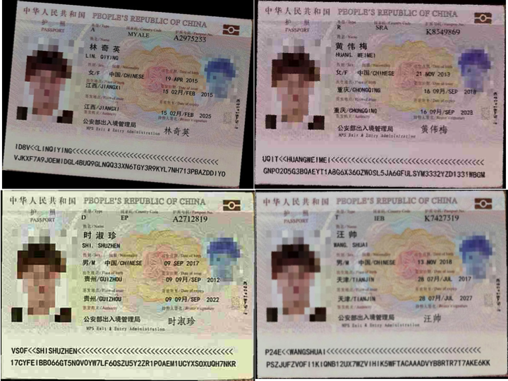
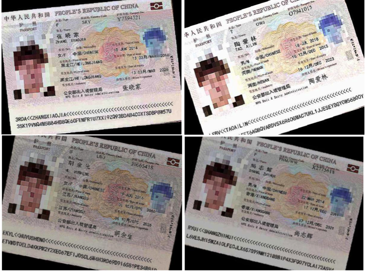

# EATEN: Entity-aware Attention for Single Shot Visual Text Extraction     
Accepted to ICDAR 2019      
Authors: He Guo, Xiameng Qin, Jiaming Liu, Junyu Han, Jingtuo Liu and Errui Ding     

## Abstract
This repository is designed to provide an open-source dataset for Visual Text Extraction.

## Samples
### Train ticket
#### Real images 

#### Synthetic images 
##### Some clean images

##### Some hard images

### Passport
##### Some images

##### Some hard images

### Business card

## Downloads
The dataset can be downloaded through the following link:   
[baiduyun](https://pan.baidu.com/s/1HVMa_bpCeegticZVFOkJ5g), PASSWORD: e4z1 

Some details:         

|scenes| number | size|
|-------------------|:-------------------:|:---------------------:|
|train ticket | 300k synth + 1.9 real| 13G|  
|passport | 100k synth |5.8G|   
|business card | 200k synth| 19G|   

## Citation
